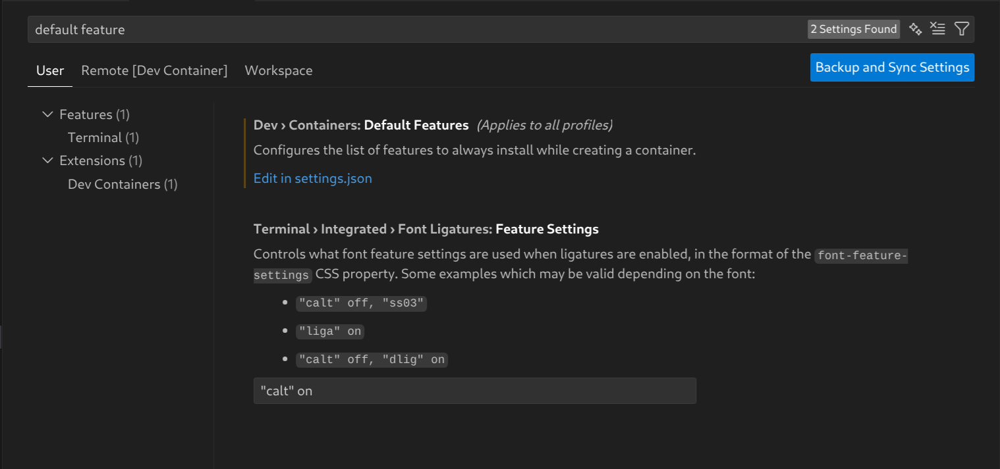

## OS Support

We support Ubuntu-based operating systems and have tested the following container images:

- ubuntu:latest
- mcr.microsoft.com/devcontainers/base:ubuntu
- mcr.microsoft.com/devcontainers/universal:linux

## Use with `default feature`

To install the Gemini CLI across all your development environments that use Dev Containers locally in VSCode, add this feature to `Dev › Containers: Default Features`. To do this, open the VSCode settings, search for `default feature`, and then add the feature by selecting `Edit in settings.json`.




## Persistence of CLI Credentials

This feature preserves your authentication state (e.g., Google OAuth tokens) across container rebuilds. By defining a named volume in `devcontainer.json`, sensitive credential files are stored outside the container's ephemeral file system. Please note that this feature specifically targets the `Login with Google` option, ensuring that your session persists across container rebuilds.

### How it works

- A dedicated volume should be mounted at `/dc/gemini-cli`.
- The feature symlinks the authentication file (`~/.gemini/oauth_creds.json`) to this persistent volume.
- This ensures your login session persists while allowing other configuration files to be managed through your GEMINIFILES repository.

### Example of `devcontainer.json`

```json
"features": {
    "gemini-cli": {
        "keep_google_api_credentials": true
    }
},

"mounts": [
    {
        "source": "gemini-cli-persistence",
        "target": "/dc/gemini-cli",
        "type": "volume"
    }
]
```

### Authentication Scope & Persistence Limitations

This persistence feature is designed specifically for the `Login with Google` (OAuth) flow. It does **not** manage or affect the following authentication methods:

- API Key (Token): API Keys are not stored in the persistent volume. Users are expected to manage them securely via environment variables or their preferred secret management provider.

- Vertex AI: Authentication for Vertex AI is handled via the Google Cloud CLI (gcloud). To persist Vertex AI credentials, use the `gcloud-cli-persistence` feature instead of (or in addition to) this one.

